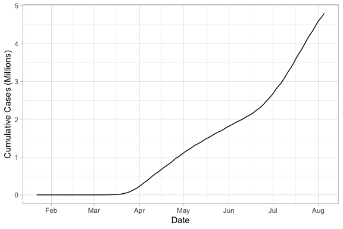
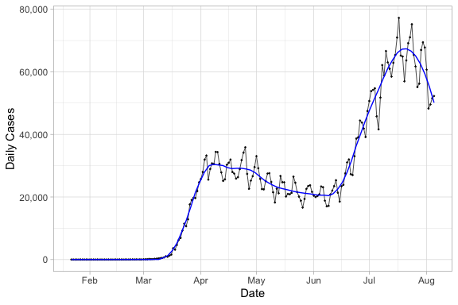
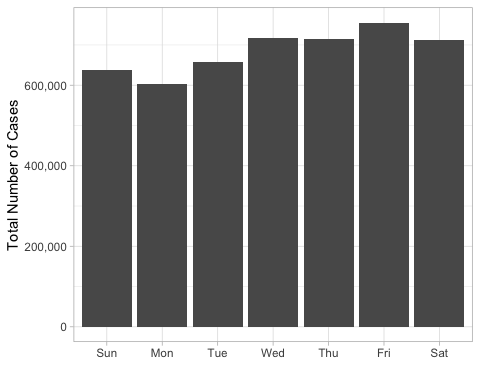
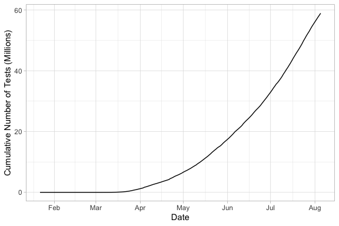
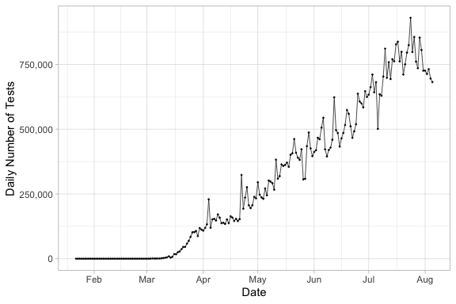
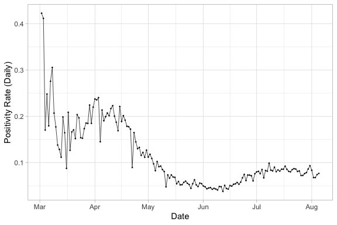
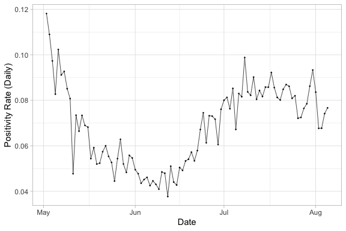
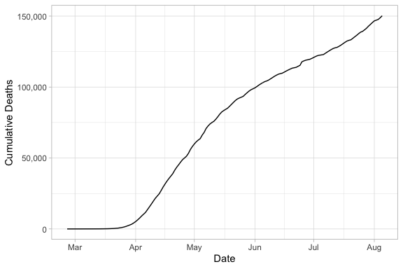
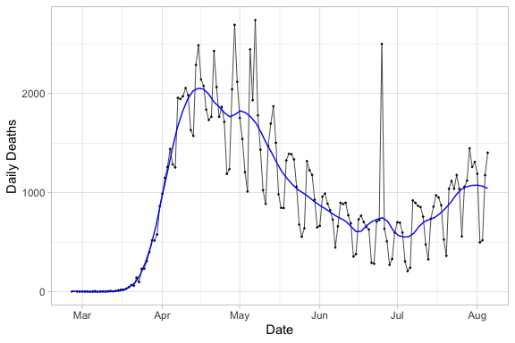
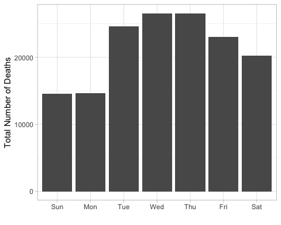

This report is an exploratory graphical analysis of coronavirus data from [The Covid Tracking Project](https://covidtracking.com/data).  The data with variable descriptions are provided at this [link](https://covidtracking.com/data/download).  Presented below are time series plots of the number of cases, number of tests performed, proportion of test that are positive (positivity rate), and number of deaths for the United States.  The plots were created using the R graphics package [ggplot2](https://ggplot2.tidyverse.org/).    


```r
library(dplyr)
library(ggplot2)
library(scales)
library(lubridate)
```


```r
covid_us <- read.csv("https://covidtracking.com/api/v1/us/daily.csv")
#head(covid_us)
```


```r
# convert date column to Date object
covid_us$date <- ymd(covid_us$date)
class(covid_us$date)
```

```
## [1] "Date"
```

```r
# put rows in chronological order
covid_us <- covid_us %>% arrange(date)
```

# Time series plots
## Cases
### Cumulative number of cases

```r
ggplot(covid_us, aes(date, positive / 10^6)) + geom_line() +
  xlab("Date") + ylab("Cumulative Cases (Millions)") +
  scale_x_date(date_breaks = "1 month", date_labels = "%b") +
  theme_light()
```

<!-- -->

### Daily number of cases

```r
ggplot(covid_us, aes(date, positiveIncrease)) + 
  geom_line(col="black", size=0.25) + 
  geom_point(col="black", size=0.25, alpha=0.75) +
  geom_smooth(method="loess", se=F, span=0.175, size=0.5, col='blue') +
  xlab("Date") + ylab("Daily Cases") +
  scale_x_date(date_breaks = "1 month", date_labels = "%b") +
  scale_y_continuous(labels = comma) + 
  theme_light()
```

<!-- -->

### Total case counts by day of week

The total number of cases do not appear uniformly distributed across the days of the week.  The barplot shows that most cases are reported on Friday, while the least are reported on Monday.  The time series plot of the daily number of coronavirus cases also shows a cyclical, weekly pattern to when cases are being reported.      


```r
wday_case_totals <- covid_us %>%
  filter(positiveIncrease > 0) %>%
  mutate(wday = wday(date, label=T)) %>%
  group_by(wday) %>%
  summarise(caseTotal = sum(positiveIncrease))
wday_case_totals
```

```
## # A tibble: 7 x 2
##   wday  caseTotal
##   <ord>     <int>
## 1 Sun      638941
## 2 Mon      602358
## 3 Tue      657195
## 4 Wed      716173
## 5 Thu      714778
## 6 Fri      755747
## 7 Sat      712765
```

```r
ggplot(wday_case_totals, aes(wday, caseTotal)) + geom_col() +
  theme_light() + scale_y_continuous(labels = comma) + 
  xlab("") + ylab("Total Number of Cases")
```

<!-- -->


## Testing
### Cumulative number of tests


```r
ggplot(covid_us, aes(date, totalTestResults / 10^6)) + geom_line() +
  xlab("Date") + ylab("Cumulative Number of Tests (Millions)") +
  scale_x_date(date_breaks = "1 month", date_labels = "%b") +
  theme_light()
```

<!-- -->

### Daily number of tests

```r
ggplot(covid_us, aes(date, totalTestResultsIncrease)) + 
  geom_line(col="black", size=0.25) + 
  geom_point(col="black", size=0.25, alpha=0.75) +
  scale_y_continuous(labels = comma) +
  scale_x_date(date_breaks = "1 month", date_labels = "%b") +
  xlab("Date") + ylab("Daily Number of Tests") +
  theme_light()
```

<!-- -->


### Proportion of tests that are positive 
In addition to the number of cases, the proportion of tests that are positive, or *positivity rate*, is an important indicator of how well the virus is contained.  In fact, the raw number of cases can be a meaningless metric without reference to the number of tests performed.   A high positivity rate indicates that only the sickest patients are being tested, and that not enough tests are being performed to understand the spread and prevalence of the virus.  A low positivity rate, on the other hand, indicates that testing capacity is more sufficient, and the data can be better used to infer the prevalence of the virus, including possible asymptomatic spread.  Some references:

[Coronavirus Case Counts Are Meaningless](https://fivethirtyeight.com/features/coronavirus-case-counts-are-meaningless/) by Nate Silver

[Which U.S. States Meet WHO Recommended Testing Criteria](https://coronavirus.jhu.edu/testing/testing-positivity) from Johns Hopkins

[The Other COVID-19 Metric We Should Be Using](https://covidtracking.com/blog/the-other-covid-19-metric) from The COVID Tracking Project


```r
covid_us <- covid_us %>% mutate(propTestResultsPositive =  positiveIncrease / totalTestResultsIncrease)
covid_us %>% 
  filter(date > as.Date("2020-03-01")) %>% 
  ggplot(aes(date, propTestResultsPositive)) + 
  geom_line(col="black", size=0.25) + 
  geom_point(col="black", size=0.25, alpha=0.75) + 
  xlab("Date") + ylab("Positivity Rate (Daily)") +
  scale_x_date(date_breaks = "1 month", date_labels = "%b") +
  theme_light()
```

<!-- -->


```r
covid_us %>% 
  filter(date > as.Date("2020-05-01")) %>% 
  ggplot(aes(date, propTestResultsPositive)) + 
  geom_line(col="black", size=0.25) + 
  geom_point(col="black", size=0.25, alpha=0.75) + 
  xlab("Date") + ylab("Positivity Rate (Daily)") +
  scale_x_date(date_breaks = "1 month", date_labels = "%b") +
  theme_light()
```

<!-- -->

## Deaths
### Cumulative number of deaths


```r
covid_us %>%
  filter(deathIncrease > 0) %>% 
  ggplot(aes(date, death)) + geom_line() +
    xlab("Date") + ylab("Cumulative Deaths") +
    scale_x_date(date_breaks = "1 month", date_labels = "%b") +
    scale_y_continuous(labels = comma) +
    theme_light()
```

<!-- -->

### Daily number of deaths
Spike on June 25 caused by New Jersey adding ~2,000 probable deaths, which includes deaths from previous months [[Covid Tracking Project](https://covidtracking.com/data)].


```r
covid_us %>%
  filter(deathIncrease > 0) %>% 
  ggplot(aes(date, deathIncrease)) +
  geom_line(col="black", size=0.25) + geom_point(col="black", size=0.25, alpha=0.75) +
  geom_smooth(method="loess", se=F, span=0.175, size=0.5, col='blue') +
  xlab("Date") + ylab("Daily Deaths") +
  scale_x_date(date_breaks = "1 month", date_labels = "%b") +
  theme_light()
```

<!-- -->

### Total death counts by day of week

The total number of deaths also do not appear uniformly distributed across the days of the week.  


```r
wday_death_totals <- covid_us %>%
  filter(deathIncrease > 0) %>%
  mutate(wday = wday(date, label=T)) %>%
  group_by(wday) %>%
  summarise(deathTotal = sum(deathIncrease))
wday_death_totals
```

```
## # A tibble: 7 x 2
##   wday  deathTotal
##   <ord>      <int>
## 1 Sun        14551
## 2 Mon        14655
## 3 Tue        24598
## 4 Wed        26576
## 5 Thu        26564
## 6 Fri        23062
## 7 Sat        20226
```

```r
ggplot(wday_death_totals, aes(wday, deathTotal)) + geom_col() +
  xlab("") + ylab("Total Number of Deaths") +
  theme_light()
```

<!-- -->

## Hospitalizations
